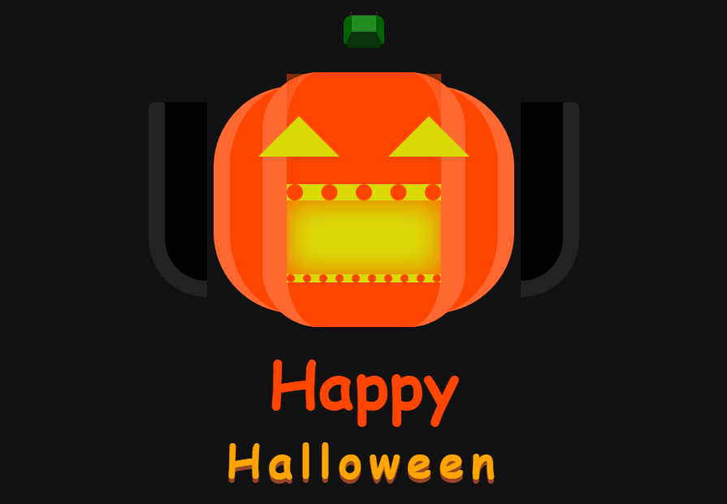

# 🎃 Jack O' Lantern - Halloween Animation

Este projeto é uma página web interativa com uma lanterna de abóbora animada para celebrar o Halloween. Ele foi desenvolvido utilizando **HTML** e **CSS** para criar uma experiência visual divertida e temática.

## ✨ Funcionalidades

- **Animação Interativa**: A abóbora tem olhos e boca que se movem de maneira animada, criando um efeito de vida.
- **Efeito Tipográfico**: O texto "Happy Halloween" possui uma animação que altera o espaçamento entre as letras, adicionando uma atmosfera festiva.
- **Design Responsivo**: O layout se adapta a diferentes tamanhos de tela, garantindo uma boa exibição em qualquer dispositivo.

## 📂 Estrutura do Projeto

O projeto é composto por dois arquivos principais:

### `index.html`
Este arquivo contém a estrutura básica da página, com as seguintes seções:
- **Lanterna de abóbora**: Inclui os elementos visuais para os olhos, boca e formato da lanterna.
- **Texto "Happy Halloween"**: Exibe o título com animação.

### `style.css`
Este arquivo define o estilo e as animações, com os seguintes aspectos:
- **@keyframes**: Controla a animação dos olhos, boca, texto e da face da abóbora.
- **Cores temáticas**: Tons de **orangered**, **amarelo** e **preto** criam uma atmosfera assustadora e típica do Halloween.
- **Fonte personalizada**: A fonte **Bungee**, do Google Fonts, é utilizada para dar um estilo retrô e divertido ao texto.

## 🚀 Como Executar o Projeto

1. **Clone ou faça o download** deste repositório.
2. Abra o arquivo `index.html` diretamente em qualquer navegador moderno para visualizar a animação.

## 🛠️ Tecnologias Utilizadas

- **HTML5**: Estrutura da página web.
- **CSS3**: Estilização e animação.
- **Google Fonts**: A fonte **Bungee** foi utilizada para o texto.

## 👁️ Pré-visualização

A página exibe uma abóbora animada com olhos e boca dinâmicos, e o texto "Happy Halloween" com animação de espaçamento de letras. O design usa cores vibrantes e efeitos para capturar o espírito do Halloween.

---

### 📸 Captura de Tela

---

## 🎃 Inspire-se com o Halloween!

Sinta-se à vontade para modificar ou melhorar o design para criar sua própria versão desta página temática!
